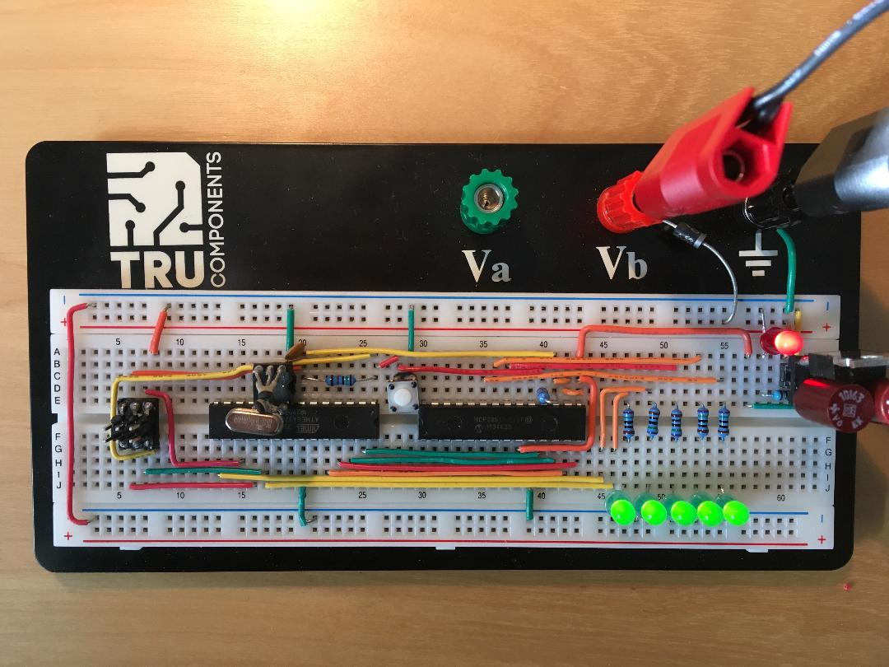

# Example Chapter04_04
## LED Objects and Polymorphism

Example chapter04_04 uses an intuitive LED class hierarchy
to exemplify object oriented design and polymorphism.
In this example, five LEDs in total having three individual kinds
of port control are toggled in near unison with a frequency
of approximately $\frac{1}{2}~\text{Hz}$.

## LED Classes

The class hierarchy consists of an LED base class called
[`led_base`](https://github.com/ckormanyos/real-time-cpp/blob/26cb8f63b555e7ee6c3afc96ce53646e070aeb67/examples/chapter04_04/src/mcal_led/mcal_led_base.h#L8)
which is located in namespace `mcal::led`.
Two LED classes `led_port` and `led_pwm` are derived from the
LED base class.

The port class `led_port` itself uses two kinds of ports,
including one microcontroller port and three other ports on an external
serial SPI(TM) port axpander chip of type MICROCHIP(R) MCP23S17.
The PWM based LED is toggled via the dimming of the PWM duty cycle.

The port expander chip is controlled with SPI(TM).
In this particular example, an all-software bus has been
developed using four microcontroller port pins toggled
manually. This SPI(TM) communication class itself
is derived from a communication base class that provides
a uniform interface for rudimentary byte read and write
functions.

## Application Description

The application places five LED base class pointers in an
`std::array` and subsequently toggles them in a range-based
`for`-loop in the application task.

The LED base class pointers, for instance, are shown below.

```cpp
std::array<mcal::led::led_base*, 5U> app_led_base_class_pointers =
{{
  mcal::led::led0(),
  mcal::led::led1(),
  mcal::led::led2(),
  mcal::led::led3(),
  mcal::led::led4()
}};
```

The application task performs the toggle functionality
at a frequency of approximately $\frac{1}{2}~\text{Hz}$ using
dynamic polymorphism on the base class pointer list.

```cpp
void app::led::task_func()
{
  if(app_led_timer.timeout())
  {
    app_led_timer.start_interval(app_led_one_sec);

    for(auto& p_led : app_led_base_class_pointers)
    {
      p_led->toggle();
    }

    app_led_state_is_on = (!app_led_state_is_on);
  }
}
```

## Hardware Setup

The five discrete LEDs in this example are fitted and setup
in the following way:

| LED        | Port                        | Details                                                            |
| ---------- | --------------------------- | -------------------------------------------------------            |
| LED0       | microcontroller `portb.5`   | port toggle high / low, $750~\Omega$                               |
| LED1       | microcontroller `portb.1`   | Timer A, PWM duty cycle $0~{\ldots}~100~{\text{over}}~750~\Omega$  |
| LED2       | port expander pin `GPA0`    | port toggle high / low, SPI(TM) software drive, $750~\Omega$       |
| LED3       | port expander pin `GPA1`    | port toggle high / low, SPI(TM) software drive, $750~\Omega$       |
| LED4       | port expander pin `GPA2`    | port toggle high / low, SPI(TM) software drive, $750~\Omega$       |

In this example, we use ports from both the microcontroller as well
as an external port expander chip. Hardware adressing is used
on the port expander chip. The port expander address is
hard-wired to the value 7 via connecting each of the three
pins `A0` ... `A2` to $+{5}~\text{V}$.

The connections of the port expander chip are tabulated below.

| Port Expander Pin | Expander Function | Connection      |
| ------------- | ---------------- | ----------           |
|    9          | VDD              | $+{5}~\text{V}$      |
|    10         | VSS              | GND                  |
|    11         | CS (NOT)         | `portc.4`            |
|    12         | SCK              | `portc.3`            |
|    13         | SI               | `portc.1`            |
|    14         | SO               | `portc.2`            |
|    15         | A0               | $+{5}~\text{V}$      |
|    16         | A1               | $+{5}~\text{V}$      |
|    17         | A2               | $+{5}~\text{V}$      |
|    18         | RESET (NOT)      | 15 kOhm to $+{5}~\text{V}$ pullup over switch to GND |
|    21         | GPA0             | $750~\Omega$ to LED2 |
|    22         | GPA1             | $750~\Omega$ to LED3 |
|    23         | GPA2             | $750~\Omega$ to LED4 |

The hardware setup is pictured in the image below.


