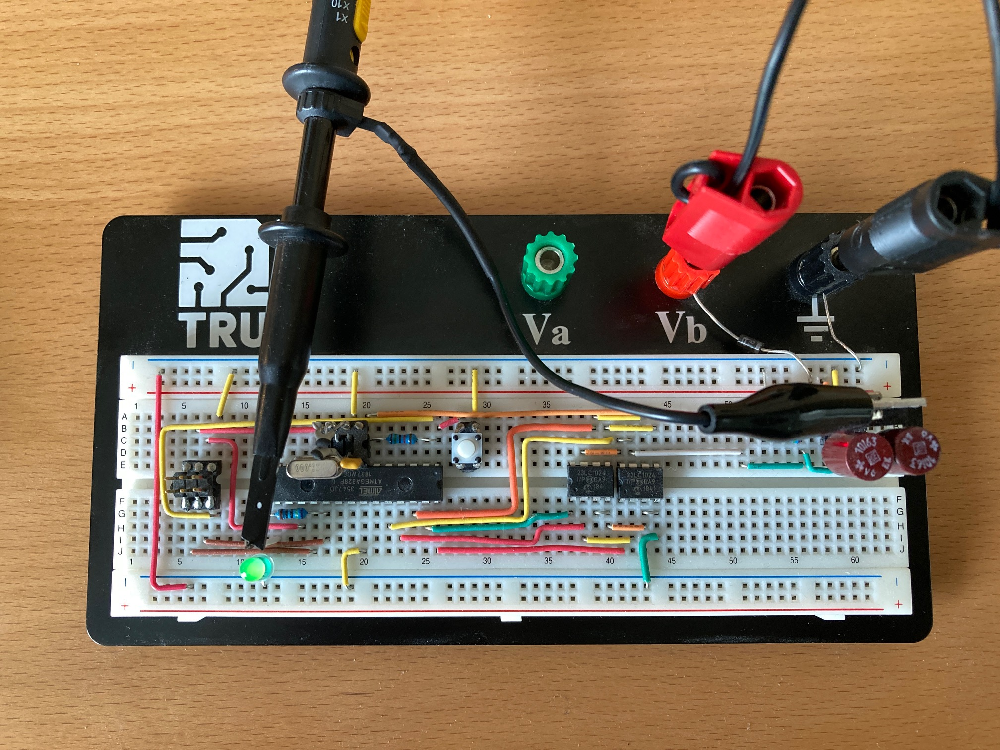
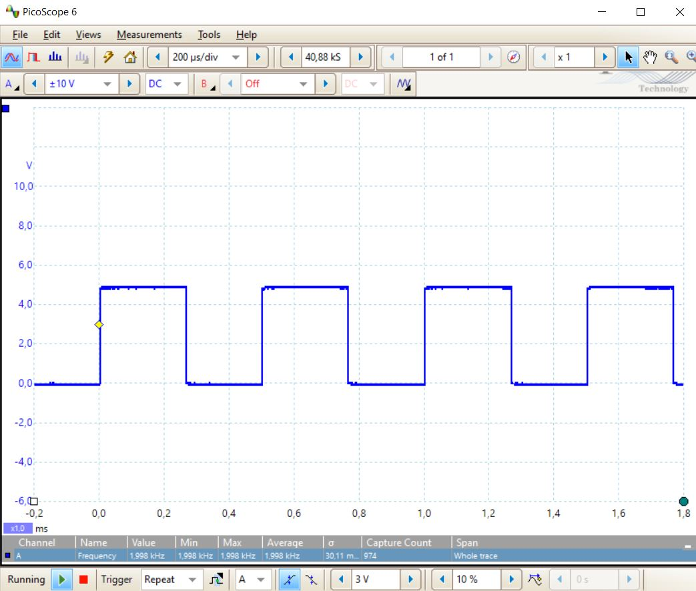

# Example Chapter10_08 (advanced level)
## External SPI RAM and Computing 10,001 Digits of Pi

<p align="center">
    <a href="https://godbolt.org/z/bf9PsPK4b" alt="godbolt">
        </a>
</p>

This advanced example extends available RAM via SPI SRAM chips.
It uses a Pi Spigot algorithm to compute up to approximately
$10,001$ decimal digits of the mathematical constant $\pi$.
Along the way, this example implements fascinating memory management mechanisms
including external-RAM-based iterators, containers and algorithms
in modern C++ style.

This example embodies a stunning depiction
of computational complexity running in a real-world, real-time system.
In addition to maintaining real-time multitasking operation,
it simultaneously highlights the quite detailed description
of the Pi Spigot algorithm's complexity that can
be found in the corresponding book section.

## Application Description

The famous Pi Spigot algorithm is often used to compute
modestly small numbers of decimal digits of the mathematical constant $\pi$.

A simple expression of a Spigot algorithm
for the base-10 representation of $\pi$
is provided in Eq. 6.1, Sect. 6.1,
page 78 of Arndt and Haenel's [Pi Unleashed](https://www.springer.com/gp/book/9783642567353).

$$\dfrac{1}{3}\Biggl(2 + \dfrac{2}{5}\Biggl( 2 + \dfrac{3}{7}\Biggl(2 + \ldots \Biggr)\Biggr)\Biggr)$$

This equation has been templated and extended in the Pi Spigot program
of our book. Consider, in particular, the code snippet
[chapter10_08-000_pi_spigot_single.cpp](../../code_snippets/chapter10/chapter10_08-000_pi_spigot_single.cpp).
Compiling and running this program as it stands produces the following output
(which may vary regarding timing of your system):

```sh
result_digit: 10001
result_test_pi_spigot_single_is_ok: true
elapsed time: 0.265s
operation_count: 19155868
input memory consumption: 137788

result_is_ok: true
```

In the default release of this program
from the code snippets area running on a PC,
the Pi Spigot algorithm is set up to compute $10,001$
digits of $\pi$.
Play around with the output digit count in the program.
Switch from the default setting of $10,001$
digits down to  $1,001$
digits or even up to $100,001$ digits.
Watch the operation count and memory consumption vary with
size of the output digit count.

## Try it at godbolt

A similar implementation of the Pi Spigot program has been setup
at [godbolt](https://godbolt.org), where it can be compiled and executed.
This setup computes $10,001$ decimal digits of $\pi$.

Use the following [short link](https://godbolt.org/z/bf9PsPK4b)
to further explore this program.

## 8-Bit MCU Adaptions

In this example, the Pi Spigot program has been adapted
to run on our target system with the 8-bit microcontroller.
In order to do so, two external serial SPI SRAM chips
have been used.
The default release on the 8-bit MCU is set up for $1,001$
decimal digits of $\pi$.

The $1,001$ decimal digit $\pi$
calculation requires approximately $90~\text{s}$ on this particular setup.

Memory allocation schemes and external SRAM iterators/containers
are described fully in the book. These have been used to
abstract memory access to the off-chip SRAMs
and allow the Pi Spigot program to run essentially
out of the box in about the same form as found
in the code snippets area.

For this particular example adapted to the 8-bit MCU,
a state-machine variation
of the single-state program is used. The state-machine
variation divides the computation time of the individual
Pi Spigot operations among the time slices of the idle
task of the multitasking scheduler. The internal state
variables of the Pi Spigot calculation are stored
in static variables along the way as the state machine
consequently, iteratively and deliberately works its way
through the Pi Spigot calculation.

The program runs continuously, performing successive back-to-back
calculations. The subsequent Pi Spigot calculation begins
when the previous one finishes.
Simultaneously, the well-known _blinky_ application with
1s blinking on/off is handled in the LED task.

A tabulated, known control value containing $10,011$
decimal digits of $\pi$
is stored in the constant-valued, ROM-based `array` variable
called `local::control::sys_idle_pi_spigot_cntrl`. This control value
is used to check the calculated digits of $\pi$
on the fly as they are retrieved from each successive iteration
of the calculation.

Progress of the Pi Spigot calculation is expressed as the
duty cycle of a PWM signal on `timer_a` output on `portb.1`, microcontroller pin 15.
An oscilloscope is required in order to verify the calculation
progress via PWM duty cycle measurement.
A possible program extension
could mount and subsequently implement control for
an additional resistor/LED series combination
or an LCD, as seen in
[example Chapter10_08a](../chapter10_08a),
in order to display the calculation progress more obviously.
The duty cycle representing number of digits computed
accelerates toward the end of each calculation,
which mimics the nature of the calculation itself.

## Hardware Setup

Memory extension uses two serial SPI SRAM chips of type Microchip(R) 23LC1024.
Each chip has $1~\text{Mbit}$, in other words $128~\text{kByte}$, of asynchronous SRAM.
These 8-pin SRAM chips are straightforward to use.
They are controlled with easy-to-understand commands
that execute read/write operations in either single byte sequences
or small page bursts. A lightweight communication class
called `mcal::memroy::sram::memory_sram_microchip_23lc1024`
that is used to control the SRAM chips can be found
in the file
[mcal_memory_sram_microchip_23lc1024.h](./src/mcal/avr/mcal_memory_sram_microchip_23lc1024.h)

The $10,001$ decimal digit $\pi$
calculation requires approximately $140~\text{kByte}$ RAM.
Thus two $128~\text{kByte}$ chips are required
for the full $10,001$ digit range intended for this example.

The [all-software SPI driver](./src/mcal_spi/mcal_spi_software_port_driver.h)
communicates directly with the off-chip SRAM devices.
The standard protocol described in the SRAM chip's manual(s) is used.

Pinning in this example is summarized in the table below.

| Pin SRAM_0,1   |  SRAM Function | MCU Function            | MCU Pin            |
| -------------- | -------------- | ----------------------- | ------------------ |
| 1 (SRAM_0)     |    CS_0        | `portc.4`               |       27           |
| 6 (SRAM_0)     |    SCK_0       | `portc.3`               |       26           |
| 2 (SRAM_0)     |    SO_0        | `portc.2`               |       25           |
| 5 (SRAM_0)     |    SI_0        | `portc.1`               |       24           |
| 1 (SRAM_1)     |    CS_1        | `portc.5`               |       28           |
| 6 (SRAM_1)     |    SCK_1       | `portc.3`               |  shared with SCK_0 |
| 2 (SRAM_1)     |    SO_1        | `portc.2`               |  shared with SO_0  |
| 5 (SRAM_1)     |    SI_1        | `portc.1`               |  shared with SI_0  |
| NA             |                | `portb.1`/`timer_a` PWM |       15           |

The hardware setup is pictured in the image below with an oscilloscope measurement
in action.



The PWM signal representing calculation progress is shown below.
The PWM signal has a frequency of approximately two kilohertz.


