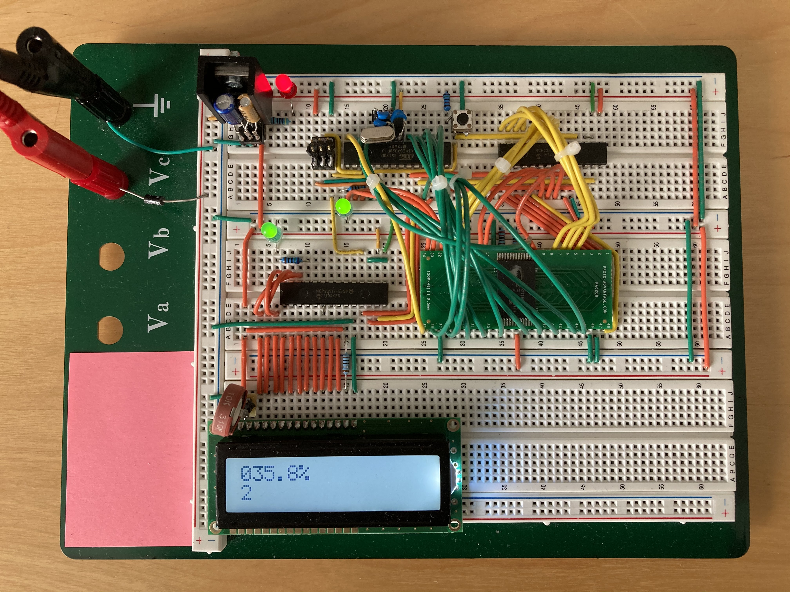
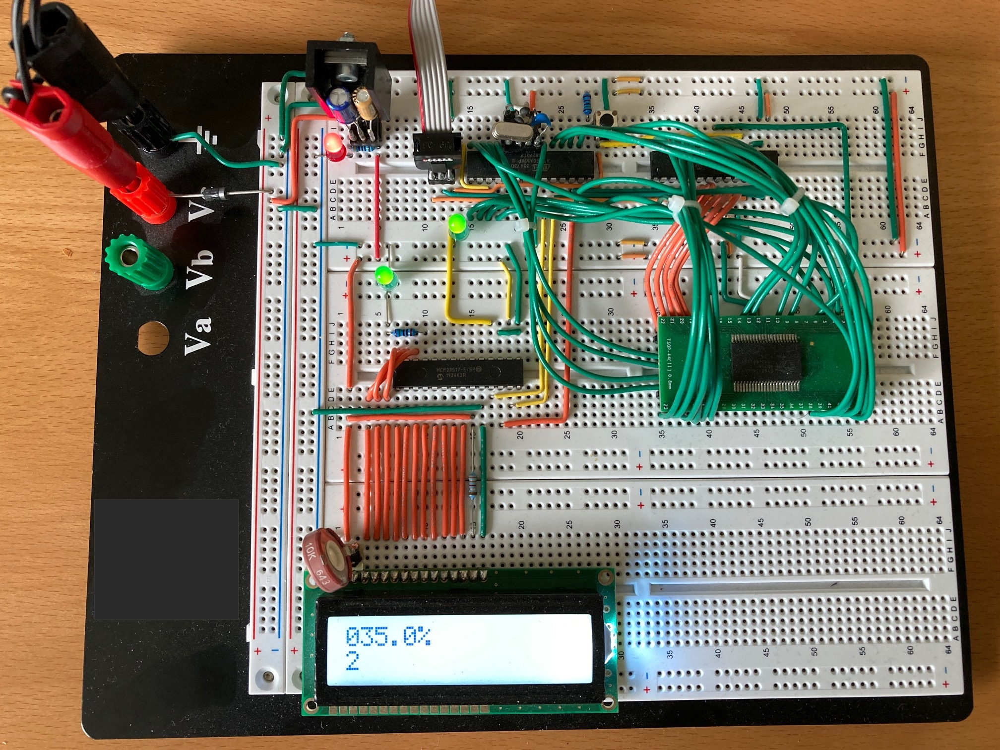

# Example Chapter10_08a (advanced level)
## Parallel SRAM and Computing 100,001 Digits of Pi

This advanced example picks up on the idea of the previous Example Chapter10_08
and extends RAM even further with an external
$2~\text{MByte}$ asynchronous parallel SRAM brick.
This memory extension significantly expands the range of the Pi Spigot calculation
with the 8-bit MCU. This 2 MByte RAM extension enables, in fact,
the computation and verification of up to and beyond $100,001$
decimal digits of the mathematical constant $\pi$.

This example is challenging and requires utmost attention to detail
combined with advanced
laboratory and programming skills. With, however, a bit of concentrated
effort (especially to make the hardware and provide for clean,
iterator-based programmatic access to the external parallel SRAM bricks),
Example Chapter10_08a makes this mammoth numerical calculation let's say as
_easy_ _as_ _pie_.

## Application Description

The Pi Spigot program used in this example has essentially
the exact form that has been used in the previous Example Chapter10_08.
The algorithms and their implementations remain,
in fact, identically the same.
The difference in this example is the extension to up to $2~\text{MByte}$
SRAM allowing for the calculation of even more digits of $\pi$.

Care needs to be taken to wire the parallel SRAM brick properly
(as shown below). When the hardware setup is correct,
however, it is actually relatively straightforward
(although definitely requires careful attention to detail)
to write a prallel SRAM driver for the 8-bit MCU.
The results of these activities
are expressed in the template classes
`mcal::memroy::sram::memory_sram_parallel_cypress_cy62158e`
and
`mcal::memroy::sram::memory_sram_parallel_cypress_cy62167gn`
found in the files
[mcal_memory_sram_parallel_cypress_cy62158e.h](./src/mcal/avr/mcal_memory_sram_parallel_cypress_cy62158e.h)
and
[mcal_memory_sram_parallel_cypress_cy62167gn.h](./src/mcal/avr/mcal_memory_sram_parallel_cypress_cy62167gn.h),
respectively. The former controls a 1 MByte parallel SRAM
brick of type CY62158E
while the latter controls a 2 MByte parallel SRAM
brick of type
CY62167GN, both from Cypress(R), an Infineon Company.
The class for the larger brick is cleverly devised
to use a superset of the chip addresses and is, as such,
capable of also driving the chip having half the memory.

SRAM memory abstractions of specialized iterators and containers,
as shown both in great detail in the book as well as in the previous example,
are employed. These program artifacts abstract memory read/write
operations with the external SRAM bricks to standard C++ template form.
The result is memory access resulting in iterator/container usage
that _looks_ _and_ _feels_ essentially the same as would be expected
from normal iterator/container access within the context of modern C++
programming.

The $1~\text{MByte}$ version can handle $\pi$
calculations up to and a slightly beyond $50,001$
decimal digits, whereas the full $2~\text{MByte}$ brick
is required for the $100,001$ digit calculation.

Calculation progress has a resolution of

$$\Bigl[\frac{1}{10}\Bigr]{\\%}\text{.}$$

This progress is expressed in alpha-numeric form on an LCD module.
The LCD is of type NHD-0216K1Z-FSW-FBW-L-42862
from Newhaven Display international and features
two-by-sixteen characters. It uses standard
industry 8-bit parallel control in this example.

The familiar _blinky_ LED task is also exercised. In this
particular example, though, there are two distinct LEDs that
partake in synchronized blinking.
The first blinking LED is attached the usual microcontroller pin `portb.5`.
The second blinking LED is on one of the port expander pins.
The second LED confirms the smooth running of the
Pi Spigot application. The second blinking LED also
provides a simple diagnostic _heartbeat_ verifying
the integrity of the communication between
the port expander and the MCU.

As mentioned in the book and in the previous example,
the Pi Spigot calculation time
is essentially solely determined by the operation count.
This increases quadratically with increasing number
of decimal digits targeted in a given calculation.

Although we're not intending to break any super-computing
performace or speed records with the 8-bit MCU hooked up
to external parallel SRAM, the advantage of parallel port access
can be noticed.
Indeed, in this setup, the $1,001$
decimal digit $\pi$ calculation takes
approximately $50~\text{s}$ compared with approximately $90~\text{s}$
in the previous example using serial SRAM chips.

Do, however, be prepared for a bit of a wait as
the digit count in the Pi Spigot calculation
(having quadratically increasing computational complexity)
climbs higher and higher.
The full $100,001$ decimal digit $\pi$ calculation
requires about $6~\text{days}$ to run on the 8-bit MCU with external
asynchronous parallel SRAM memory.

## Hardware Setup

It is hoped that this example will challenge the microcontroller
laboratory enthusiast and provide for a fulfilling technical experience
for those intrepid makers who wrangle with it and take it on.
In fact, the wiring of this example requires attentive
fitting of each wire properly to its dedicated pin(s) on the MCU
or relevant device(s).

Two port expanders of type
Microchip(R) MCP23S17 are needed to provide enough
digital input/output pins for the necessary
address lines on the SRAM bricks and MCU connections.
These port expanders are controlled with SPI.
Fitting the parallel SRAM brick on a breadboard requires the use
of a secondary SMD-to-DIP adapter to which the SMD device
itself actually needs to be meticulously soldered.

Pinning in this example is, indeed, rich in detail.
Pinning variants differ slightly depending on whether
we intend to use either the 1 MByte brick
or the 2 MByte brick.

The pin connections of the 2 MByte memory brick
of type Cypress(R) MoBL(R) CY62167GN in 48-pin TSOP
are shown in the table below. The pinnning has
been selected with certain considerations in mind that
make the software driver for the memory brick
more straightforward and less complicated to write.
Where possible, for instance, entire 8-bit ports or groups
of port pins have been matched on SRAM/MCU/Port-Expander to simplify
read/write operations on the driver level.

| SRAM CY62167GN TSOP-48   | Function   | Device Connection       |
| ------------------------ | ---------- | ----------------------- |
| 1                        | A15        | Port Expander GPB_3     |
| 2                        | A14        | Port Expander GPB_2     |
| 3                        | A13        | Port Expander GPB_1     |
| 4                        | A12        | Port Expander GPB_0     |
| 5                        | A11        | Port Expander GPA_7     |
| 6                        | A10        | Port Expander GPA_6     |
| 7                        | A9         | Port Expander GPA_5     |
| 8                        | A8         | Port Expander GPA_4     |
| 9                        | A19        | Port Expander GPB_7     |
| 10                       | NC         | open/no connection      |
| 11                       | WE_NOT     | MCU PB4/pin18           |
| 12                       | CE2        | +5V over 2 kOhm         |
| 13                       | NC         | open/no connection      |
| 14                       | BHE_NOT    | +5V over 2 kOhm         |
| 15                       | BLE_NOT    | GND                     |
| 16                       | A18        | Port Expander GPB_6     |
| 17                       | A17        | Port Expander GPB_5     |
| 18                       | A7         | Port Expander GPA_3     |
| 19                       | A6         | Port Expander GPA_2     |
| 20                       | A5         | Port Expander GPA_1     |
| 21                       | A4         | Port Expander GPA_0     |
| 22                       | A3         | MCU PB3/pin17           |
| 23                       | A2         | MCU PB2/pin16           |
| 24                       | A1         | MCU PB1/pin15           |
| 25                       | A0         | MCU PB0/pin14           |
| 26                       | CE1_NOT    | MCU PC4/pin27           |
| 27                       | VSS        | GND                     |
| 28                       | OE_NOT     | MCU PC5/pin28           |
| 29                       | I/O_0      | MCU PD0/pin2            |
| 30                       | I/O_8      | open/no connection      |
| 31                       | I/O_1      | MCU PD1/pin3            |
| 32                       | I/O_9      | open/no connection      |
| 33                       | I/O_2      | MCU PD2/pin4            |
| 34                       | I/O_10     | open/no connection      |
| 35                       | I/O_3      | MCU PD3/pin5            |
| 36                       | I/O_11     | open/no connection      |
| 37                       | VCC        | +5V                     |
| 38                       | I/O_4      | MCU PD4/pin6            |
| 39                       | I/O_12     | open/no connection      |
| 40                       | I/O_5      | MCU PD5/pin11           |
| 41                       | I/O_13     | open/no connection      |
| 42                       | I/O_6      | MCU PD6/pin12           |
| 43                       | I/O_14     | open/no connection      |
| 44                       | I/O_7      | MCU PD7/pin13           |
| 45                       | I/O_15/A20 | MCU PC2/pin25           |
| 46                       | GND        | GND                     |
| 47                       | BYTE_NOT   | GND                     |
| 48                       | A16        | Port Expander GPB_4     |

The hardware setup with the 2 MByte SRAM brick
is pictured in the image below.

The hardware setup with the 1 MByte SRAM brick
is pictured in the image below.

