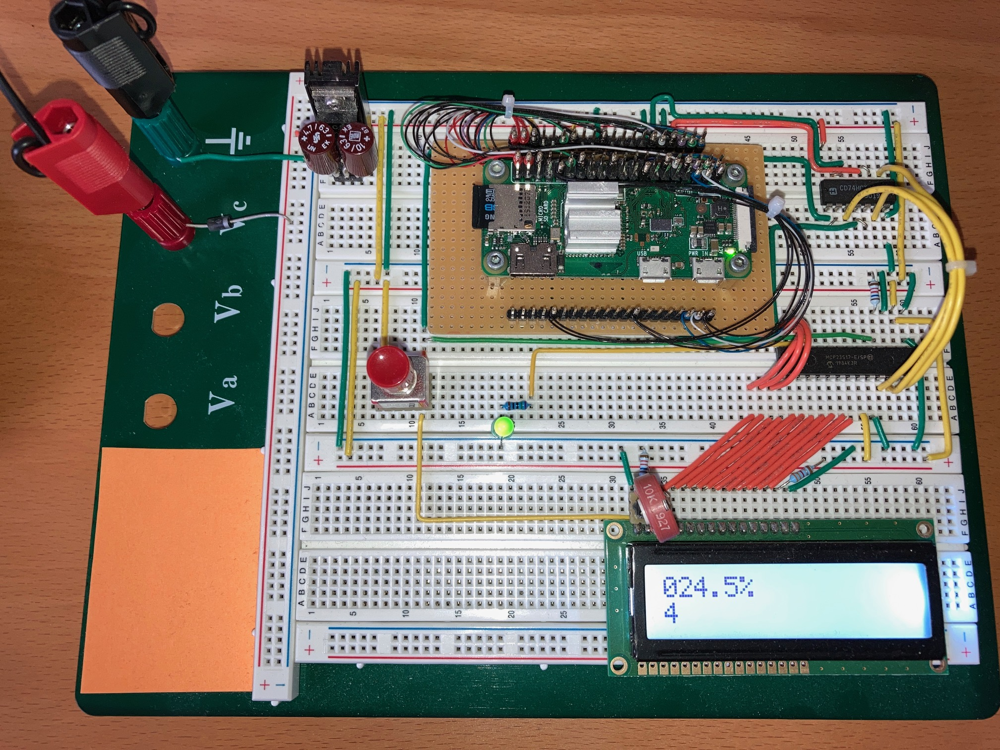

# Example Chapter10_09 (advanced level)
# 100,001 Digits of Pi on Raspberry Pi(R)

This advanced example ports the Pi Spigot

decimal digit

calculation to the powerful Arm(R)-based Raspberry Pi(R) single-board computer.
The Raspberry Pi(R) Zero WH with Arm1176JZF-S(TM) single core
controller is used. This system has ample 512 MByte bus-addressable SRAM.

Using the single-board computer system with its more powerful controller
and ample 512 MByte SRAM further simplifies and speeds up the

decimal digit

calculation using the Pi Spigot program.
In particular, tedious wiring and software development efforts required
for our target with the 8-bit microcontroller in previous
Examples Chapter10_08 and 10_08a are drastically reduced and simplified
in this example.

# Application Description

The same Pi Spigot algorithm is used as has been used in
Examples Chapter10_08 and 10_08a. The single-board computer is operated
OS-less in _bare-metal_ mode with no input or output device and self-written
startup and chip initialization code. Real-time afficicionados
will relish the stark and bare use of the on-board Arm(R) controller
with its corresponding manually-written startup, initialization
and memory-access optimization code.

The application computes successively

decimal digits of
.
Calculation progress is displayed on
an LCD module of type NHD-0216K1Z-FSW-FBW-L-42862
from Newhaven Display international having
two-by-sixteen characters. It uses standard
industry 8-bit parallel control in this example.

A port expander chip of type
Microchip(R) MCP23S17 provides additional
digital input/output pins for the necessary
connections to the display and a second blinking LED.
A software SPI driver is sued as the main communication
with the port expander.

A skinny MCAL layer provides the needed peripheral abstractions
for timer, port I/O driver, memory-access optimization
(such as instruction and data caching), etc.

# Boot Image Contents for SD Card

TBD

# Hardware Setup

The Raspberry Pi(R) Zero WH is used out-of-the-box
without modification. Wire-wrapping techniques with skinny AWG-30 wires
are used to connect the single-board computer to power, ground
and the necessary logic peripherals. Power and ground lines have
double/quadruple strands to reduce parasitic dissipation
in the currrent-carrying lines.

The logic gate sharpens port output signal edges
and performs the conversion from 3.3V CMOS to 5V TTL.
A hand-sawed, flat-bottomed piece of corrugated aluminum is attached
to the Broadcom(R) chip for cooling.

Pinning in this example is summarized in the table below.

| Port Expander  |  Function    | Connection   |
| -------------- | ------------ | ------------ |
| 1              | GPB_0        | LCD DB_0                                       |
| 2              | GPB_1        | LCD DB_1                                       |
| 3              | GPB_2        | LCD DB_2                                       |
| 4              | GPB_3        | LCD DB_3                                       |
| 5              | GPB_4        | LCD DB_4                                       |
| 6              | GPB_5        | LCD DB_5                                       |
| 7              | GPB_6        | LCD DB_6                                       |
| 8              | GPB_7        | LCD DB_7                                       |
| 9              | V_DD         | +5V                                            |
| 10             | V_SS         | GND                                            |
| 11             | CS           | GPIO16/H36 (via `AND`-gate in 10/9, out 8)     |
| 12             | SCK          | GPIO18/H12 (via `AND`-gate in 1/2, out 3)      |
| 13             | SI           | GPIO19/H35 (via `AND`-gate in 4/5, out 6)      |
| 15             | A_0          | GND                                            |
| 16             | A_1          | +5V                                            |
| 17             | A_2          | GND                                            |
| 18             | RESET        | switch closed (non-pressed): +5V               |
|                |              | switch open (pressed): 16 kOhm pulldown to GND |
| 19-20          | INTA/B       | not connected                                  |
| 21-24          | GPA_0-3      | not connected                                  |
| 25             | GPA_4        | 750 Ohm to LED_1                               |
| 26             | GPA_5        | LCD RS                                         |
| 27             | GPA_6        | LCD R/W                                        |
| 28             | GPA_7        | LCD E                                          |

The hardware setup with the RpiZero in action calculating

decimal digits of
.
is pictured in the image below.

