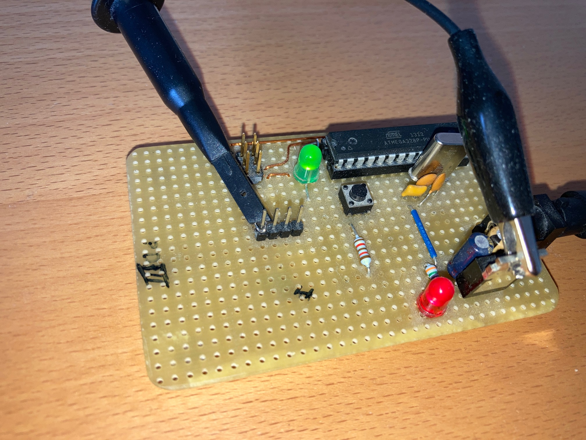
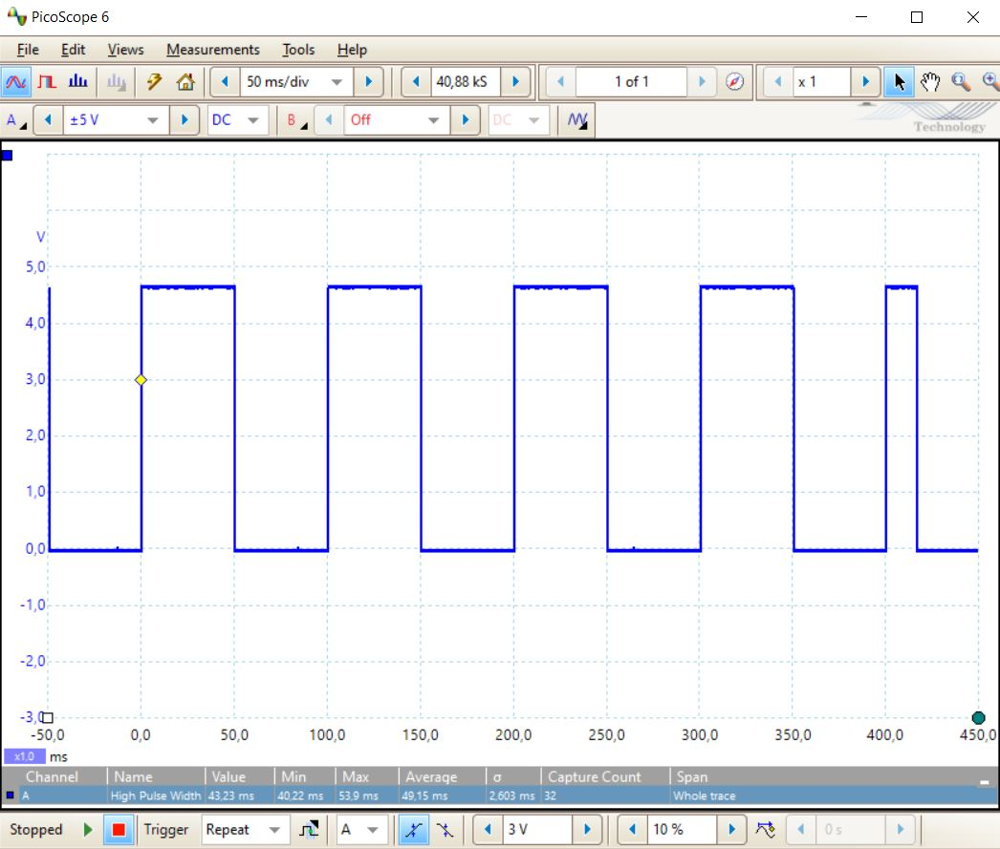

# Example Chapter11_07
# Preemptive Multitasking

This example makes straightforward use
of preemptive multitasking scheduling with a blinky-style application
that features a main task and a low-priority background task.

# Application Description

This example features two preemptive tasks within a multitasking envoronment.
The application task supports the _blinky_ functionality with LED on/off each 1s.
The application task has higher priority and also yields every 70ms.
The second task is a background task. It runs continuously,
without cooperative yield. The background task, however,
by virtue of having lower task priority will be interrupted
by the higher priority application task. The background task
toggles a second LED each 50ms.

These days there are numerous choices available when selecting OS-es
and/or multitasking schedulers for embedded systems. The selection
ranges from either commercially available, free-ware or self-written options.
In this particular expression of Example Chapter11_07, we select
[FreeRTOS](https://www.freertos.org).

The task setup, initialization and task functions
have been wrapped in convenient, OS-independent macros
and function calls. This provides a lightweight layer
of portability on top of otherwise potentially OS-specific
mechanisms and methods.

The tasks are summarized in the code snippet below.

```C
extern "C"
void app_led_task_background(void*)
{
  // This background task runs perpetually without pause, break or yield.
  // This task has lowest priority and will be interrupted by the task
  // having higher priority.

  for(;;)
  {
    while((!app_led_timer_background.timeout()))
    {
      ;
    }

    app_led_timer_background.start_interval(app_led_timer_type::milliseconds(50U));

    mcal::led::led1().toggle();
  }
}

extern "C"
void app_led_task_toggle_led0(void*)
{
  // This application task is intended to yield every 70ms. It has higher
  // priority than the background task. This task will, in fact, preemptively
  // interrupt the lower-priority background task.

  for(;;)
  {
    mcal::wdg::secure::trigger();

    if(app_led_timer_toggle_led0.timeout())
    {
      app_led_timer_toggle_led0.start_interval(app_led_timer_type::seconds(1U));

      mcal::led::led0().toggle();
    }

    OS_TASK_WAIT_YIELD(OS_TASK_MSEC(70U));
  }
}
```

The OS requires minimal context-switching and timer portions.
These are typically ported in processor-specific C/C++/assembly sources.
The port for the ATmega328P target can be found in
[port.cpp](./src/os/FreeRTOS/Source/portable/GCC-ATMega328/port.cpp).
This OS-portable part has been modified for this example
via changes including switching from a C to a C++ file,
cleaning up spaces, tabs and alignment of typing,
OS tick using `timer1` compare-match-a to generate
a tick interrupt at 100Hz (every 10ms),
using an undecorated ISR handle name `__vector_11`,
and using C++ register template access to setup the timer
for the OS tick.

# Hardware Setup

The blinky LED 1s on/off can be found on `portb.5`.
The background 10Hz toggle pin can be found on `portd.3`.

An example of a target hardware is shown in the following image.



The oscilloscope image below captures the toggle cycle
of the LED in the background task.
The background task, although programmed to toggle its
pin every 10 ms does have slight, occasional variations
in its call cycle due to task jitter and being interrupted
by the application task having higher priority.


