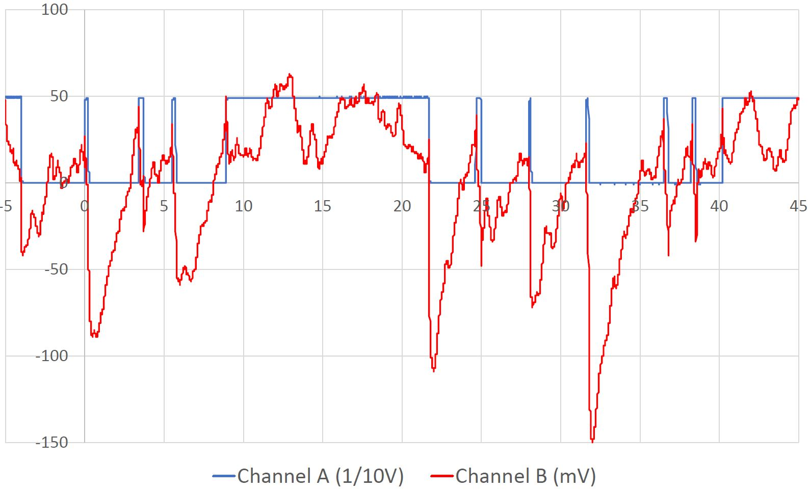

# Example Chapter16_08
# Generating and displaying 128-bit Random Prime Numbers

This advanced example uses an extended integer class
to create 128-bit random unsigned prime integers with
primality testing performed via Miller-Rabin.

This example also provides fascinating, intuitive,
visual insight into the prime number theorem
of pure mathematics.

# Application Description

This project uses an elementary electronic subcircuit
to generate a semi-random electrical noise signal.
Bits are collected from the digitized random noise
using a hardware/software random engine.
These bits are concatenated and subsequently used
to create 128-bit pseudo-prime numbers.
Primality testing uses the Miller-Rabin algorithm.
The [wide-integer](https://github.com/ckormanyos/wide-integer)
project is used to implement 128-bit unsigned integers.

In this example, Miller-Rabin testing has been implemented as a state machine.
The individual states of the prime testing machine are serviced within the
time slices of the multitasking scheduler.
Representation of the 128-bit integers is in hexadecimal format
on an LCD module of type NHD-0440AZ-FL-YBW
from Newhaven Display International having 40 characters
in width by 4 lines.

The electronic subcircuit used for creating the random digitized noise
is sketched below.

The oscilloscope image below shows a small snapshot
of the random digitized noise from this circuit.

# Deep Connection to the Prime Number Theorem

The prime number theorem postulates that the asymptotic density
of prime numbers for large ,
,
approaches

.

The detailed description in the book verifies in an intuitive
and tacit way the prime number theorem running via
this example's software running on an 8-bit micrcocontroller.
This is a really cool combination of electronics, real-time C++
template programming, and the inate elegance and beauty
of pure and applied mathematics.

# Hardware Setup

Our target with the 8-bit microcontroller is used in this example.
The random engine is implemented in software as a make-shift
partial SPI driver. The SPI input pin is `portc.5`, on which
random bits are collected to be collated into 128-bit prime candidates.

The random noise subcircuit can be observed in the central right portion
of the breadboard. The 12V supply stems from a classic LM7812
voltage regulator, from which TTL +5V is also derived for
theMCU and logic power rail.

The target hardware is shown in the image below. In this image,
the system has accumulated a few hundred pseudo-random prime
128-bit integers, with the most recent prime shown on the display.
On average, approximately 23.4 trials (of prime candidates)
have been tested for primality per found prime, in accordance
with the prime number theorem.

