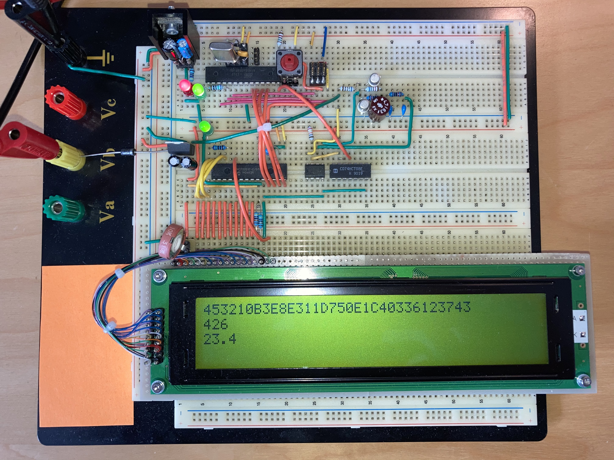

# Example Chapter16_08
# Generating and displaying 128-bit Random Prime Numbers

This advanced example uses an extended integer class
to create 128-bit random unsigned prime integers with
primality testing performed via Miller-Rabin.

This example also provides fascinating, intuitive,
visual insight into the prime number theorem
of pure mathematics.

# Application Description

This project uses an elementary electronic subcircuit
to generate a semi-random electrical noise signal.
Bits are collected from the digitized random noise
using a hardware/software random engine.
These bits are concatenated and subsequently used
to create 128-bit pseudo-prime numbers.
Primality testing uses the Miller-Rabin algorithm.
The [wide-integer](https://github.com/ckormanyos/wide-integer)
project is used to implement 128-bit unsigned integers.

In this example, Miller-Rabin testing has been implemented as a state machine.
The individual states of the prime testing machine are serviced within the
time slices of the multitasking scheduler.
Representation of the 128-bit integers is in hexadecimal format
on an LCD module having width of 40 characters.

The electronic subcircuit used for creating the random digitized noise
is sketched below.

.

The oscilloscope image below shows a small snapshot
of the random digitized noise from this circuit.

# Deep Connection to the Prime Number Theorem

TBD

# Hardware Setup

The target hardware featuring the is shown in the following image.

